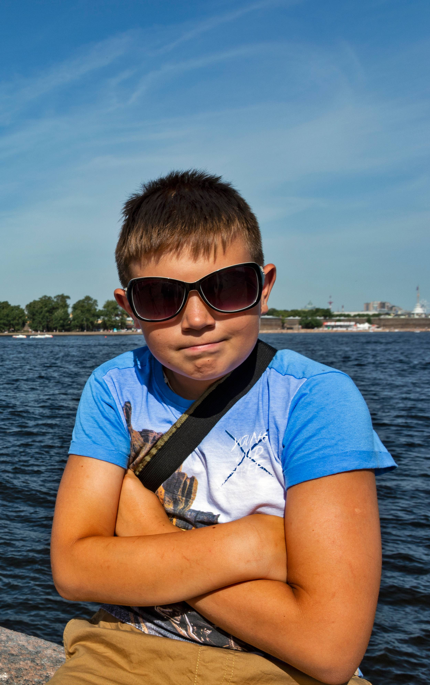

# My Portfolio

## Some info about me

Hey, i'm great and very funny dude, which like life in all her forms. Also i very like get lulz all over the place :) If talk serious, now I'm trying to undergraduate myself in testing. And I hope that no so far I'll become a genious QA-engineer!

## My interests 

Funny videos, computer games, Internet. Oh, and studying, of cource.

## What I want?

I would like to work in comfortable office, drink coffee three time at work day and get ~~as many cash as possible, dammit!!!~~. Sorry, i didn't mean any bad thing. For the **first time** I ready	to work for free.

## What I can?

Not so much <u>so far</u>, but when my learning will fully complete, I can do ___everything___. 

### By the way
> Sorry for my English - I know, it isn't good yet, because i can't find a time to passthrough special lections "English for IT workers", which Netology offers <u>for free</u>.

# Anyway, so you don't get upset, I'm attaching my photo

